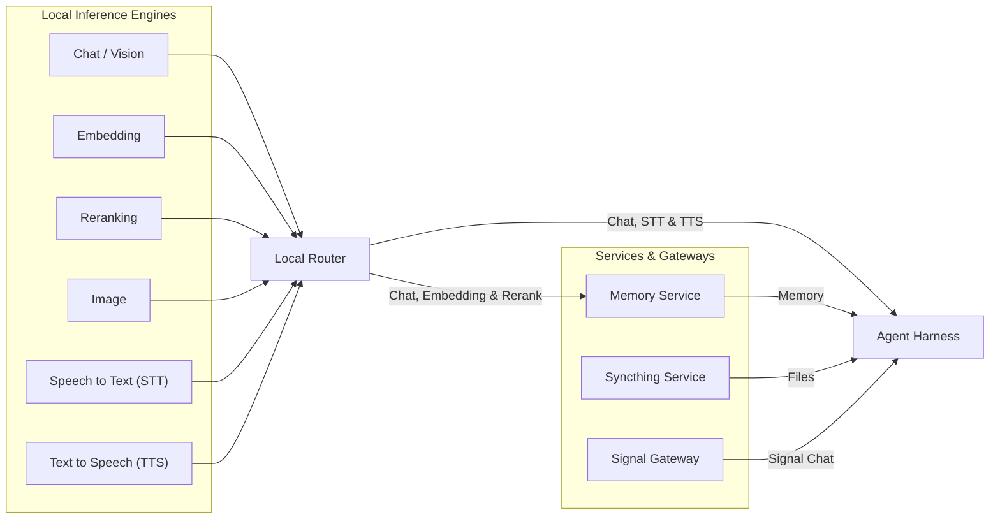

# Local Inference and Memory Service Agents Ecosystem, Agents Included

This repository contains orchestration for deploying, sandboxed local AI assistants, using local inference services.

It provides systemd-confinement configurations, bubblewrap (`bwrap`) isolation wrappers, and standardized daemon control utilities (`*-ctl` scripts) to ensure isolated agent execution.

## Repository Structure

- `README.md` — Agent/script instructions, default ports, and isolation requirements
- `assistants/` — Daemon control scripts (`*-ctl`) and configuration documentation
- `scripts/` — Benchmarking, model downloader (`local-download.sh`), and utility tools
- `skills/` — Portable skill definitions
- `research/` — Development activity reports, LLM adapter research, and benchmark notes
- `scratch/` — Workspace for temporary files and checkout sources (`scratch/*-sources`)

## Services

### Local Inference

| Service | Default Port(s) | Description / Protocol |
|---------------|-----------------|------------------------|
| **[Local Chat/Vision](#local-chat-services)** | [50080](http://localhost:50080) | Llama-server serving Chat/Vision LLM (embeddings disabled) |
| **[Local Embedding](#local-embedding-services)** | [50082](http://localhost:50082) | TEI (`text-embeddings-router`) or `llama-server` serving Text Embeddings |
| **[Local Reranking](#local-reranking-services)** | [50086](http://localhost:50086) | Llama-server serving Document Reranking |
| **[Local Speech to Text](#local-speech-to-text)** | [50090](http://localhost:50090) | Whisper-server audio transcription API (HTTP) |
| **[Local Text to Speech](#local-text-to-speech)** | [50095](http://localhost:50095) | Qwen3-tts-server audio synthesis API (HTTP) |
| **[Local Image Generation](#local-image-services)** | [50100](http://localhost:50100) | sd-server serving Image Generation API (HTTP) |
| **[Local Memory Service](#local-memory-service)** | [8888](http://localhost:8888), [8889](http://localhost:8889), [8890](http://localhost:8890) | Hindsight API (8888), Worker Control Plane (8889) & Control UI (8890) |
| **[Local Router](#local-combined-inference-router)** | [51080](http://localhost:51080) | Combined service router / OpenAI proxy (HTTP) |
| **[Local Inference Coordinator](#local-inference-coordinator)** | - | Combined service control script |

### Integration Services
| Service | Default Port(s) | Description / Protocol |
|---------------|-----------------|------------------------|
| **[Signal Integration](#signal-integration)** | [50889](http://localhost:50889), [50888](http://localhost:50888), 50887 |REST-API:50889, HTTP/JSON-RPC: 50888, TCP/JSON-RPC:50887 |
| **[Syncthing Integration](#syncthing-integration)** | [8384](http://localhost:8384), 22000 | Syncthing Web UI (HTTP) & Sync Protocol (TCP/UDP) |

### Assistant/Agent Services

| Agent | Language | Default Port(s) | Description |
| :--- | :---: | :---: | :--- |
| **[ZeroClaw](#zeroclaw)** | Rust | [42617](http://localhost:42617) | ZeroClaw Gateway |
| **[IronClaw](#ironclaw)** | Rust | [8080](http://localhost:8080) | IronClaw Web Gateway & HTTP Webhooks |
| **[LibreFang](#librefang)** | Rust | [4545](http://localhost:4545) | LibreFang daemon API (HTTP) |
| **[Hermes](#hermes)** | Python | [8642](http://localhost:8642), [9119](http://localhost:9119) | Hermes Messaging Gateway (API: 8642, UI: 9119) || **[NanoBot](#nanobot)** | Python | [8790](http://localhost:8790) | NanoBot Gateway API |
| **[PicoClaw](#picoclaw)** | Go | [18790](http://localhost:18790), [18800](http://localhost:18800) | Gateway (HTTP/Webhook) & Launcher Web UI |
| **[NanoClaw](#nanoclaw)** | TypeScript | [3000](http://localhost:3000) | Webhook Server |

See [Current Weekly Development Status](research/weekly-devel-activity.md) for GIT development.

## Helper Utilities

The repository contains several scripts under `scripts/` to assist with sandboxing, benchmarking, downloading models, and calibrating agent runtimes.

For details, see the [scripts/README.md](scripts/README.md).

## System Architecture

## Local Inference and Integrations

### Local Chat Services
- **Description**: Manages persistent `llama-server` instances for chat/vision LLM completions (`local-chat.sh`).
- **Sandboxing**: Requires `PrivateDevices=no` to access `/dev/dri` and `/dev/kfd`. Enforces `ProtectSystem=strict` while bind-mounting the user's home configuration and granting read-write access to `/data/public/machine-learning`.
- **Features**: Chat completions (`50080`) service
    - serving the main model with 3 parallel slots (80,000 tokens context size each, total 240,000 tokens). 
    - optionally serving a code completion model (`qwen-coder-fim`) with native Fill-in-the-Middle (FIM) support for editor tab completion.
- Documentation: [local-chat.md](assistants/local-chat.md)

### Local Embedding Services
- **Description**: Manages persistent text embedding servers (`local-embedding.sh`). Supports two backend engines: TEI (`text-embeddings-router` using `pplx-embed-context-v1-0.6b` by default) and `llama-server` (GGUF).
- **Sandboxing**: Requires `PrivateDevices=no` to access `/dev/dri` and `/dev/kfd`. Enforces `ProtectSystem=strict` while bind-mounting the user's home configuration and granting read-write access to `/data/public/machine-learning`.
- **Features**: Standalone text embedding server (`50082`) with mean pooling, ROCm GPU offloading, dynamic batching, and systemd sitecustomize helper patch.
- Documentation: [local-embedding.md](assistants/local-embedding.md)

### Local Reranking Services
- **Description**: Manages persistent `llama-server` instances for document reranking (`local-rerank.sh`). 
- **Sandboxing**: Requires `PrivateDevices=no` to access `/dev/dri` and `/dev/kfd` for GPU-accelerated synthesis (unless run in cpu only mode). Enforces `ProtectSystem=strict` while restricting filesystem access to the home directory and read-only system files.
- **Features**: Rerank Service (`50086`) services.
- Documentation:  [local-rerank.md](assistants/local-rerank.md)

### Local Speech-to-Text
- **Description**: Manages a persistent `whisper-server` instance for speech-to-text (STT) transcription. Serves an OpenAI-compatible audio transcription API on port 50090.
- **Sandboxing**: Requires `PrivateDevices=no` to access `/dev/dri` and `/dev/kfd` for GPU-accelerated synthesis (unless run in cpu only mode). Enforces `ProtectSystem=strict` while restricting filesystem access to the home directory and read-only system files.
- **Features**: audio transcoding using `ffmpeg`.
- Documentation: [local-speech-to-text.md](assistants/local-speech-to-text.md)

### Local Text-to-Speech
- **Description**: Manages a persistent `qwen3-tts-server` instance for text-to-speech (TTS) synthesis. Serves an OpenAI-compatible audio synthesis API on port 50095.
- **Sandboxing**: Requires `PrivateDevices=no` to access `/dev/dri` and `/dev/kfd` for GPU-accelerated synthesis (unless run in `cpu` mode). Enforces `ProtectSystem=strict` while restricting filesystem access to the home directory and read-only system files.
- **Features**: performance tuning modes cpu, fully parallelized CPU threading, and streaming/batch PCM generation.
- Documentation: [local-text-to-speech.md](assistants/local-text-to-speech.md)

### Local Image Services
- **Description**: Manages a persistent `sd-server` instance for image generation. Serves an OpenAI-compatible image generation API on port 50100.
- **Sandboxing**: Requires `PrivateDevices=no` to access `/dev/dri` and `/dev/kfd` for GPU-accelerated generation (unless run in `cpu` mode). Enforces `ProtectSystem=strict` while restricting filesystem access to the home directory and read-only system files.
- **Features**: Generates images using the `z_image_turbo-Q8_0.gguf` model with options for sampler steps, CFG scale, and backend routing.
- Documentation: [local-image.md](assistants/local-image.md)

### Local Memory Service
- **Description**: Manages a persistent Hindsight memory instance served by `hindsight-api` (port 8888) with a dedicated background task worker sidecar `hindsight-worker` serving a control plane / metrics HTTP server on port 8889 (`local-memory.sh`).
- **Sandboxing**: Enforces `ProtectSystem=strict` with `PrivateDevices=yes` and standard systemd hardening. Restricts filesystem access to the home directory (`BindPaths=%h`).
- **Features**: Long-term temporal, semantic, and entity-graph memory engine offloading embeddings, LLM reasoning, and reranking to `local-router` (port 51080) and PostgreSQL (`pgvector` + `pgroonga`). Worker control plane port configurable via `HINDSIGHT_API_WORKER_HTTP_PORT` (set to 0 to disable).
- Documentation: [local-memory.md](assistants/local-memory.md)

### Local Combined Inference Router
- **Description**: Manages a persistent FastAPI web application served by `uvicorn` that aggregates all underlying local inference services into a single OpenAI-compatible entrypoint (`local-router.sh`).
- **Sandboxing**: Enforces `ProtectSystem=strict` with `PrivateDevices=yes` (no GPU access required). Restricts filesystem access to the home directory (`BindPaths=%h`) and standard system directories read-only.
- **Features**: OpenAI-compatible routing for chat completions, embeddings, reranking, transcription, speech, and image generation. Comprehensive token usage tracking, estimated cost calculation, static HTTP error code logging (`errors_streaming` / `errors_post`), pre-formatted ASCII table reporting (`/usage?format=text`), scrapable Prometheus metrics (`/metrics`), startup synchronization checking, default model fallback routing, and graceful OpenAI-format gateway error propagation.
- Documentation: [local-router.md](assistants/local-router.md)

### Local Inference Coordinator
- **Description**: Coordinator and wrapper script to manage the installation, state, and activation of all 7 local services (`local-inference.sh`).
- **Sandboxing**: Not a system service itself, but executes individual service scripts which utilize systemd user sandboxing.
- **Features**: Bulk installation, uninstall, lifecycle control (start, stop, restart), status reports, combined logs, and automatic propagation of environment overrides (e.g. LRR_OVERRIDE) to target services.
- Documentation: [local-inference.md](assistants/local-inference.md)

### Signal Integration
- **Description**: Connects agents to Signal. Runs a `signal-cli` daemon exposing both TCP and HTTP JSON-RPC interfaces. It also provides an optional Go-based REST API wrapper for robust, HTTP-based polling/webhook integrations (like linking LibreFang).
- **Sandboxing**: Standard filesystem hardening, but disables `MemoryDenyWriteExecute` because the underlying JVM (Java) requires it for JIT compilation. 
- **Features**: Account linking via QR code, dual daemon interfaces, and isolated home directory execution to prevent contamination.
- Documentation: [signal-ctl.md](assistants/signal-ctl.md)

The following assistants have native Signal channel integration available in their source code:
- [Hermes](assistants/hermes-ctl.md)
- [IronClaw](assistants/ironclaw-ctl.md)
- [LibreFang](assistants/librefang-ctl.md)
- [NanoBot](assistants/nanobot-ctl.md)
- [ZeroClaw](assistants/zeroclaw-ctl.md)

To configure them, refer to their specific configuration sections in their respective control guides.

### Syncthing Integration
- **Description**: Manages a persistent, confined Syncthing file synchronization daemon.
- **Sandboxing**: Standard systemd strict filesystem confinement with a transient tmpfs home, mapping only configured directories. Exposes the host configuration and state directories.
- **Features**: Decentralized and secure background file synchronization for agent workspaces and shared data.
- **Documentation**: [syncthing-ctl.md](assistants/syncthing-ctl.md)

---

## Assistant Details

Each assistant in this repository is managed by a dedicated shell wrapper script (`assistants/<assistant>-ctl`) adhering to standard design and lifecycle management guidelines.

See [assistants/agents.md](assistants/agents-ctl.md) for general usage and common configuration options.

### ZeroClaw
- **Major Features**: Rust-based security-focused agent gateway and runtime featuring built-in SQLite hybrid memory (vector + keyword FTS5) and native Landlock/Bubblewrap sandbox backends.
- **Language/Runtime**: Rust (Source) / Compiled binary (Rust Backend, no Web GUI).
- **Requirements**: Support for Linux namespace isolation or Landlock.
- **Sandboxing**: **Relaxed Namespaces Profile** is enforced via the systemd unit so that ZeroClaw can spawn secure nested sub-sandboxes via `bwrap` internally.
- **Memory**: Native SQLite-based memory system. Supports `sqlite` and `sqlite-hybrid` (vector + keyword FTS5) natively; can also use PostgreSQL or Qdrant.
- **Retention/Compression/Compaction**: Features time-decay scoring (evergreen Core category, time-decayed Conversation/others with a 7-day half-life), two-phase LLM-driven memory consolidation (Daily history + Core fact extraction) at the end of each turn, and periodic memory hygiene (every 12 hours) to archive, purge, and prune database rows.
- **Search & Retrieval**: Native hybrid search (0.7 vector similarity / 0.3 keyword FTS5) directly inside SQLite.
- **Autonomous 24/7 Support**: Yes — Built-in scheduling and task memory for unattended 24/7 operations.
- **Signal Support**: Yes — Native channel integration communicating via the Go REST API wrapper (port 50889).
- **Coding Agent Support**: Yes — Natively supports **OpenCode** as a coding worker tool (`opencode_cli`).
- **Local LLM & Inference**: Supports local GGUF models via OpenAI-compatible endpoints served by `local-chat` (port 50080) or Ollama.
- **Embedding Options**: Local embeddings using the `local-embedding` server (port 50082) or Ollama, or OpenAI-compatible embedding APIs.
- **Reranking Support**: Native weighted hybrid search, or routes to external local-rerank service (`http://localhost:50086/v1/rerank`).
- **STT/TTS Support**: Natively routes voice uploads to local Whisper server (`local-speech-to-text` on port 50090) and local TTS via Qwen3-tts (`local-text-to-speech` on port 50095).
- **Agent Client Protocol**: Yes — Native stdio-based ACP server via `zeroclaw-acp-bridge` and a dedicated `Acp` (Code) pane in the `zerocode` TUI.
- **Agent to Agent Protocol**: Yes — Built-in peer-to-peer delegation via the `delegate` tool, restricted by shared risk profiles and `delegation_policy` configurations.
- **Detailed Guide & Onboarding**: [zeroclaw-ctl.md](assistants/zeroclaw-ctl.md)

### IronClaw
- **Major Features**: Security-focused Agent OS providing WASM-sandboxed tool execution, credential protection with leak detection, prompt injection defense, and endpoint allowlisting. Built as a Rust reimplementation of OpenClaw with a focus on privacy, zero-trust architecture, and self-expanding capabilities via dynamic WASM tool building.
- **Language/Runtime**: Rust (Source) / Compiled binary (Rust Backend + Web Gateway GUI).
- **Requirements**: PostgreSQL 15+ with [pgvector](https://github.com/pgvector/pgvector) extension. Rust 1.92+ for source builds. NEAR AI account for default authentication.
- **Sandboxing**: **Relaxed Namespaces Profile** to support WASM sandbox execution (wasmtime) and optional Docker sandbox orchestrator/worker pattern. `MemoryDenyWriteExecute=no` required for WASM JIT compilation.
- **Memory**: PostgreSQL 15+ database with the `pgvector` extension. Workspace filesystem provides flexible path-based storage for notes, logs, and context. Identity files maintain settings and contexts.
- **Retention/Compression/Compaction**: Context compaction supports auto-summarization of history. Settings and metadata are persisted in PostgreSQL.
- **Search & Retrieval**: Hybrid search combining full-text search and vector similarity via Reciprocal Rank Fusion (RRF) backed by PostgreSQL.
- **Autonomous 24/7 Support**: Yes — Heartbeat support (`HEARTBEAT_ENABLED`) for background tasks and cron jobs.
- **Signal Support**: Yes — Native integration communicating via the `signal-cli` HTTP daemon (port 50889).
- **Coding Agent Support**: Yes — Supports external coding agents via Agent Client Protocol (e.g. `ironclaw acp add goose`). No native OpenCode support.
- **Local LLM & Inference**: Supports local GGUF models via OpenAI-compatible endpoints served by `local-chat` (port 50080) or Ollama.
- **Embedding Options**: Local embeddings using the `local-embedding` server (port 50082) or Ollama, or remote/Ollama embeddings.
- **Reranking Support**: Native Reciprocal Rank Fusion (RRF) algorithm. No external reranker required.
- **STT/TTS Support**: Local STT via OpenAI-compatible transcription endpoint (`local-speech-to-text` on port 50090). No native TTS support.
- **Agent Client Protocol**: Yes — Configurable external coding agents using ACP commands (e.g. `ironclaw acp add goose`).
- **Agent to Agent Protocol**: Yes — Orchestrator/worker pattern for RPC-based sub-agent execution, and NEAR AI multi-agent routing.
- **Detailed Guide & Onboarding**: [ironclaw-ctl.md](assistants/ironclaw-ctl.md)

### Hermes
- **Major Features**: Messaging Gateway designed for agent-to-agent and agent-to-human integration. Features an OpenAI-compatible API and a Dashboard Web UI. Supports graceful shutdowns and nested container execution.
- **Language/Runtime**: Python (Source) / private 3.11 Python Runtime /opt (Web-based Dashboard GUI).
- **Requirements**: `~/.local/sandbox/hermes` for persistent state, `~/agent-shared` for integration. Can integrate with podman/docker backend.
- **Sandboxing**: Utilizes the **Relaxed Namespaces Profile** to support nested `bwrap` orchestration. Isolated `HOME` directory redirection.
- **Memory**: Built-in SQLite-based SessionDB/State management. Keeps localized context via `MEMORY.md` and `USER.md` prompt injections. Context compaction (`ContextCompressor`) supports tool output pruning (removes screenshots, replaces outputs with 1-line summaries), token-budget tail protection, and iterative summary updates (LLM summarizes middle turns). Offline trajectory compressor (`trajectory_compressor.py`) compresses trajectories under a target budget (default 15,250 tokens) for model training.
- **Search & Retrieval**: SQLite FTS5 for keyword search, plus vector search using the `sqlite-vec` extension. Direct integrations with external vector databases (Qdrant, Chroma) and memory frameworks (Mem0, Honcho).
- **Autonomous 24/7 Support**: Yes — Built-in cron scheduler with platform delivery. Background batch and SWE runners (`batch_runner.py` / `mini_swe_runner.py`).
- **Signal Support**: Yes — Native integration connecting to a local `signal-cli` HTTP daemon (port 50888/50889).
- **Coding Agent Support**: Yes — Supports Claude Code, Codex, and **OpenCode** via bundled skills.
- **Local LLM & Inference**: Supports local GGUF models via `local-chat` (port 50080) or Ollama.
- **Embedding Options**: Local embeddings via `local-embedding` (port 50082) or Ollama, or remote embedding providers (OpenAI, Cohere, Jina, Voyage AI).
- **Reranking Support**: Native reranking via auxiliary model slots and QMD hybrid retrieval engine, or routes to external reranker (`http://localhost:50086/v1/rerank`).
- **STT/TTS Support**: Local STT via local Whisper server (`local-speech-to-text` on port 50090). No native TTS support.
- **Agent Client Protocol (ACP)**: Yes — Native stdio-based ACP server adapter (`acp_adapter/server.py`) for editor integrations (VS Code, Zed, JetBrains).
- **Agent to Agent Protocol**: Yes — Supports spawning isolated subagents for parallel workstreams and calling tools/subagents via RPC.
- **Detailed Guide & Onboarding**: [hermes-ctl.md](assistants/hermes-ctl.md)

### NanoBot
- **Major Features**: Lightweight python service built with `uv` featuring an onboarding setup wizard, a structured two-stage memory system ("Dream"), and Bubblewrap tool confinement.
- **Language/Runtime**: Python (Source) / Python runtime managed by `uv` (Python CLI + Setup Wizard, no Web GUI).
- **Requirements**: `uv` package manager installed.
- **Sandboxing**: Relies on the **Relaxed Namespaces Profile** because it natively spawns agent code wrapped in nested `bwrap` isolation. Isolated `HOME`.
- **Memory**: Two-stage memory system. Active conversation buffers in session jsonl files, and long-term memory in a file-based `MEMORY.md` (and persona/user preferences in `SOUL.md`/`USER.md`). Auto-versioned via GitStore. Auto-compaction of idle sessions via `AutoCompact` based on `session_ttl_minutes` limit (keeps last 8 messages, archives the rest into session metadata). Context-length/token-triggered memory consolidation (`maybe_consolidate_by_tokens`) during active turns loops to archive message chunks to `history.jsonl`. Ephemeral background "Dream" loop reads `history.jsonl` (tracked via `.dream_cursor`) and runs an ephemeral agent to synthesize and update `MEMORY.md`, `SOUL.md`, or `USER.md` with auto-commits via Git.
- **Search & Retrieval**: Vector similarity search (RAG) for long-term memory. Document Store for indexing and searching local files (PDFs, TXT, markdown). External search via MCP tools (Brave Search).
- **Autonomous 24/7 Support**: Yes — Periodic background "Dream" loop and cron tasks.
- **Signal Support**: Yes — Native integration via HTTP Server-Sent Events (SSE) (port 50888) with markdown-to-Signal formatting.
- **Coding Agent Support**: None (No OpenCode support).
- **Local LLM & Inference**: Routes to local GGUF models via `local-chat` (port 50080) or Ollama.
- **Embedding Options**: Local embeddings via `local-embedding` (port 50082) or Ollama, or remote embeddings.
- **Reranking Support**: No native reranking. Integrates with external reranker via custom MCP tools.
- **STT/TTS Support**: Local STT via local Whisper server (`local-speech-to-text` on port 50090). No native local TTS.
- **Agent Client Protocol (ACP)**: No ACP support.
- **Agent to Agent Protocol**: Yes — Background subagent spawning (`SubagentManager`) communicating asynchronously via the message bus (`MessageBus` / `InboundMessage` system injection).
- **Detailed Guide & Onboarding**: [nanobot-ctl.md](assistants/nanobot-ctl.md)

### LibreFang
- **Major Features**: Hardened Agent OS daemon providing isolated execution environments and coordinating complex multi-agent workflows. It is a community fork of the former OpenFang project.
- **Language/Runtime**: Rust (Source) / Compiled binary (Rust Backend + Web-based Dashboard GUI).
- **Requirements**: `~/.local/sandbox/librefang` and `~/agent-shared`.
- **Sandboxing**: **Relaxed Namespaces Profile** to support bubblewrap (`bwrap`) nested sandboxing for sub-agents. Read-only system paths and strict filesystem protection for the host.
- **Memory**: SQLite-based memory system and vector storage for persistent agent memories and knowledge. Custom configuration workspace.
- **Retention/Compression/Compaction**: Context limit handling: automatically extracts facts and summarizes history when approaching context limits.
- **Search & Retrieval**: Native SQLite and vector memory stores for persistent agent memory, task scheduling, and background search/research. Can connect to external databases via MCP.
- **Autonomous 24/7 Support**: Yes — Built-in scheduling and task memory for running 24/7 (run autonomous background execution via `hand activate researcher` or other hands).
- **Signal Support**: Yes — Native channel integration interfacing with the Go REST API wrapper (port 50889), using `[[sidecar_channels]]` adapter `librefang.sidecar.adapters.signal`.
- **Coding Agent Support**: Yes — Supports Claude Code, Aider, Qwen Code, Gemini CLI, and Codex CLI (spawned as subprocesses; No native OpenCode support).
- **Local LLM & Inference**: Supports local GGUF models via OpenAI-compatible endpoints served by `local-chat` (port 50080) or Ollama.
- **Embedding Options**: Local embeddings using the `local-embedding` server (port 50082) or Ollama, or remote/Ollama embeddings.
- **Reranking Support**: None. Reranking is not supported by the LibreFang daemon.
- **STT/TTS Support**: Local STT via local Whisper server (`local-speech-to-text` on port 50090) and local TTS via Qwen3-tts (`local-text-to-speech` on port 50095) supported via a patched package (`librefang-git` with `feature-local-stt-tts` patchset).
- **Agent Client Protocol**: Yes — Bridges the runtime to the Agent Client Protocol (ACP) for editor integrations (stdio or Unix socket).
- **Agent to Agent Protocol**: Yes — Spawns subagents isolated with bubblewrap (`bwrap`), passing context via `SubagentContext` for context inheritance.
- **Detailed Guide & Onboarding**: [librefang-ctl.md](assistants/librefang-ctl.md)

### PicoClaw
- **Major Features**: Ultra-lightweight gateway (<10MB memory) with built-in web console and CLI integration, leveraging Model Context Protocol (MCP) for tools/memory.
- **Language/Runtime**: Go (Source) / Compiled binary (Go Backend + Web-based Console GUI).
- **Requirements**: `~/.local/sandbox/picoclaw` for persistent configuration.
- **Sandboxing**: **Relaxed Namespaces Profile**. Uses standard agent isolation with redirected `HOME` and strict filesystem protection. Isolated `HOME`.
- **Memory**: RAW JSON files for session/history (history limit default 50). No native vector db.
- **Retention/Compression/Compaction**: Simple context limit: history limit (default 50). No native compression.
- **Search & Retrieval**: Uses Model Context Protocol (MCP) to delegate search/retrieval tasks to external databases (such as `sqlite-vec` MCP, Qdrant MCP, or Chroma MCP).
- **Autonomous 24/7 Support**: Yes — Messaging gateway daemon background service (`picoclaw-launcher -no-browser`).
- **Signal Support**: No — Not natively supported.
- **Coding Agent Support**: Yes — Supports Claude Code, Codex, and Copilot CLI via provider-wrapped CLI execution (No OpenCode support).
- **Local LLM & Inference**: Routes to local GGUF models via `local-chat` (port 50080) or Ollama.
- **Embedding Options**: Local embeddings via `local-embedding` (port 50082) or Ollama via API routing or MCP.
- **Reranking Support**: No native reranking. Reranking can be delegated via MCP to the local-inference reranker endpoint on port 50086.
- **STT/TTS Support**: Local STT by defining an ASR provider pointing to the local whisper-server on port 50090. No native TTS engine; requires an external MCP TTS tool.
- **Agent Client Protocol**: No native ACP support.
- **Agent to Agent Protocol**: Yes — Supports `spawn` (asynchronous background subagents via goroutines) and `delegate` (synchronous targeted subagents) tools, with target allowlist validation.
- **Detailed Guide & Onboarding**: [picoclaw-ctl.md](assistants/picoclaw-ctl.md)

### NanoClaw
- **Major Features**: Node.js webhook server designed for securely executing containerized runtime tools and managing agent workspaces.
- **Language/Runtime**: TypeScript/Node.js (Source) / Node.js containerized (Node.js Webhook Backend, no Web GUI).
- **Requirements**: Requires Docker/Podman running locally to spawn tool environments.
- **Sandboxing**: **Relaxed Namespaces Profile** with `PrivateDevices=no`. Strict profiles are dropped to allow the agent to launch local Docker/Podman containers successfully.
- **Memory**: Per-session SQLite database mounted inside the container at `/workspace/session.db` (containing `messages_in` and `messages_out` tables) and a central SQLite database. Maintains `CLAUDE.md` and related markdown files in isolated agent group directories under `/workspace/agent/`.
- **Retention/Compression/Compaction**: Context limit handling is handled by the agent (e.g. Claude SDK) discovering its own session data in `.claude/` inside `/workspace/.claude/`. No native compaction.
- **Search & Retrieval**: Uses SQLite databases within the Node.js process to maintain state. Maintains `CLAUDE.md` and related markdown files in isolated agent group directories. Heavy search, retrieval, and vector storage tasks are delegated to external MCP servers (like `sqlite-vec` MCP, Qdrant MCP, or Chroma MCP) or handled by the agent calling custom tools.
- **Autonomous 24/7 Support**: Yes — background host sweep (every ~60s) and active container poll (~1s) check for due `process_after` / `deliver_after` timestamps, reschedule recurring tasks using cron, and wake up agents.
- **Signal Support**: No — Not natively supported.
- **Coding Agent Support**: None (No native OpenCode support), but has an optional `add-opencode` skill for local inference.
- **Local LLM & Inference**: Routes to local GGUF models via OpenAI-compatible endpoints served by `local-chat` (port 50080) or Ollama.
- **Embedding Options**: Local embeddings via `local-embedding` (port 50082) or Ollama, or remote embeddings.
- **Reranking Support**: No native reranking. Reranking can be added via a custom skill or by configuring an MCP tool that calls the local-inference reranker endpoint on port 50086.
- **STT/TTS Support**: No native STT/TTS in the core daemon, but easily integrated via custom tools/skills calling `local-speech-to-text` (port 50090) and `local-text-to-speech` (port 50095).
- **Agent Client Protocol**: No native ACP support.
- **Agent to Agent Protocol**: Yes — supported via target-agent routing on `messages_out`. An agent-runner can set `channel_type: 'agent'`, `platform_id` to the target agent group ID, and `thread_id` to a target session ID. The host reads this, validates permissions, and writes a `messages_in` row to the target session's DB.
- **Detailed Guide & Onboarding**: [nanoclaw-ctl.md](assistants/nanoclaw-ctl.md)

