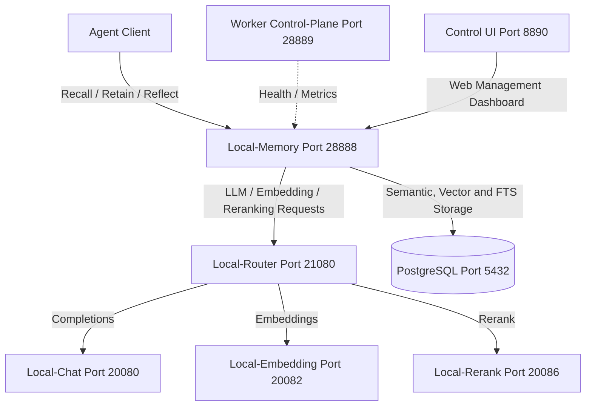

# Standalone Hindsight Memory Service Guide

`local-memory.sh` manages the standalone Hindsight memory API server systemd user service (`local-memory.service`), running the Hindsight FastAPI memory server served by `hindsight-api` on port `28888` alongside a dedicated task worker sidecar (`hindsight-worker`) serving a control plane / metrics server on port `28889` and a Next.js Control Plane Web UI sidecar (`hindsight-control-plane`) on port `8890`. It provides long-term temporal, semantic, and entity-graph memory for local agents.

- **Control Wrapper**: [assistants/local-memory.sh](assistants/local-memory.sh)

---

## Architectural Interconnection

Hindsight functions as an agentic memory hub, coordinating with the other standalone services managed by `local-inference.sh`. It delegates heavy tasks (like embedding generation, chat reasoning, and re-ranking) to these external dedicated servers via the central `local-router` (port `21080`):



In `local_external` mode, the Hindsight service itself remains lightweight: it offloads vector calculations to PostgreSQL via `pgvector` and `pgroonga`, and redirects machine-learning queries to the router, avoiding loading heavy model weights (like PyTorch or HuggingFace transformers) within its own Python virtual environment.

---

## Installation & Arch Linux Dependencies

Hindsight requires PostgreSQL with the `pgvector` and `pgroonga` extensions and `nltk-data` (NLTK Corpora, grammars a.o.) installed. Node.js is required for the Control Plane Web UI sidecar.

On Arch Linux, these must be installed via Pacman / AUR.

### 1. Install System and AUR Packages

Run the following commands to install PostgreSQL, pgvector, pgroonga, and Node.js:

```bash
# Install PostgreSQL, pgvector, pgroonga, and Node.js
sudo pacman -S postgresql pgvector pgroonga nodejs npm
# Install NLTK Corpora from Arch extra repos
sudo pacman -S nltk-data
```

### 2. Configure PostgreSQL User and Database

To set up the Hindsight database and enable the required extensions:

1. Log in as the `postgres` administrator system user:
   ```bash
   sudo -u postgres -i
   ```
2. Create a strong password and new PostgreSQL database role for the service (e.g., `hindsight`):
   ```bash
   tr -dc 'A-Za-z0-9' < /dev/urandom | head -c 32; echo
   createuser --interactive --pwprompt
   # Enter name of role to add: hindsight
   # Shall the new role be a superuser? no
   # Shall the new role be allowed to create databases? no
   # Shall the new role be allowed to create more new roles? no
   ```
3. Create the database owned by the new user:
   ```bash
   createdb -O hindsight hindsight_db
   ```
4. Connect to the database and register both extensions:
   ```bash
   psql -d hindsight_db -c "CREATE EXTENSION IF NOT EXISTS vector;"
   psql -d hindsight_db -c "CREATE EXTENSION IF NOT EXISTS pgroonga;"
   ```
5. Exit back to your user account:
   ```bash
   exit
   ```

### 3. Verify Database Setup

You can check if the database extensions are properly configured and loaded by running:
```bash
psql -U hindsight -d hindsight_db -h localhost -c "\dx"
```
Both `vector` and `pgroonga` should be listed in the output table.

---

## Service Installation

Install the virtual environment and default configuration files:

```bash
./local-memory.sh install
```

This subcommand:
1. Recreates a clean Python virtual environment at `~/.local/sandbox/local-memory/venv` using `uv`.
2. Bypasses Python 3.14+ package compilation and runtime ABI compatibility issues (like with `litellm`) by creating the virtual environment using `uv`-managed Python 3.12 (`--python 3.12`).
3. Installs `hindsight-client` and `hindsight-api-slim` into the virtual environment.
4. Installs `@vectorize-io/hindsight-control-plane` via `npm` into `~/.local/sandbox/local-memory/control-plane`.
5. Creates a default service configuration file at `~/.config/systemd/user/local-memory.env` with `worker` and `controlui` sidecars enabled by default.
6. Writes and registers `local-memory.service` in systemd.

To uninstall and clean up (which completely removes the sandbox directory):
```bash
./local-memory.sh uninstall
```

---

## Configuration

The service is configured in:
- `~/.config/systemd/user/local-memory.env`

Default configuration values:
```env
# Service Configuration
LMEM_PORT="28888"
LMEM_HOST="127.0.0.1"
LMEM_SERVICE_CMD="%h/.local/sandbox/local-memory/venv/bin/hindsight-api"
LMEM_SERVICE_ARGS="--port 28888 --host 127.0.0.1"
LMEM_SIDECARS="worker controlui"
LMEM_SIDECAR_WORKER_CMD="%h/.local/sandbox/local-memory/venv/bin/hindsight-worker"
LMEM_SIDECAR_WORKER_ARGS="--poll-interval 500"
LMEM_SIDECAR_CONTROLUI_CMD="%h/.local/sandbox/local-memory/control-plane/node_modules/.bin/hindsight-control-plane"
LMEM_SIDECAR_CONTROLUI_ARGS="--port 8890 --hostname 0.0.0.0 --api-url http://127.0.0.1:28888"

# Hindsight daemon configuration
HINDSIGHT_API_RUN_MIGRATIONS_ON_STARTUP="true"
HINDSIGHT_API_WORKER_ENABLED="false"
HINDSIGHT_API_WORKER_HTTP_PORT="28889"
HINDSIGHT_API_MCP_ENABLED="true"

# Extra body parameters passed to local-router (including client identification)
HINDSIGHT_API_LLM_EXTRA_BODY='{"chat_template_kwargs": {"enable_thinking": false}, "client_id": "hindsight"}'
```

## Usage Commands

```bash
# Start/Stop/Restart the service
./local-memory.sh start
./local-memory.sh stop
./local-memory.sh restart

# Check runtime status
./local-memory.sh status

# Tail service logs
./local-memory.sh logs -f

# Edit service environment configuration and auto-restart
./local-memory.sh edit

# Display service file, environment file, and transient execution command
./local-memory.sh cat

# Run API validation health check
./local-memory.sh test

# Run Hindsight as a transient systemd user service or foreground daemon
./local-memory.sh exec [--env KEY=VALUE]* [-- custom-args...]

# Run a custom command inside the service environment (transient/foreground)
./local-memory.sh run [--env KEY=VALUE]* <command> [args...]

# Spawn an interactive shell inside the service environment (transient/foreground)
./local-memory.sh shell [--env KEY=VALUE]*
```

### In-Memory Environment Overrides

`exec`, `run`, and `shell` support transient overrides via `--env KEY=VALUE` which are passed directly to systemd-run or local foreground shells without touching your disk configurations.

---

## Sidecars Configuration

`local-memory.sh` supports spawning background sidecar processes (such as a Control Plane worker, local MCP server, or web dashboard) alongside the main `hindsight-api` service. All sidecars are lifecycle-managed via process traps and terminate automatically if either the main daemon or any sidecar exits.

To configure a sidecar:

1. **Edit `~/.config/systemd/user/local-memory.env`** and add the sidecar name(s) to `LMEM_SIDECARS`:
   ```env
   LMEM_SIDECARS="controlplane"
   ```
   *(Multiple sidecars can be listed separated by spaces, e.g. `LMEM_SIDECARS="controlplane mcp"`)*

2. **Define the sidecar command and arguments**:
   Each sidecar derives its configuration environment variables from its uppercase name (e.g., `controlplane` -> `CONTROLPLANE`):
   ```env
   # Control plane worker sidecar
   LMEM_SIDECAR_WORKER_CMD="%h/.local/sandbox/local-memory/venv/bin/hindsight-worker"
   LMEM_SIDECAR_WORKER_ARGS="--poll-interval 500"

   # Worker control plane / metrics port (default: 28889)
   # Set to 28889 to enable the control plane (/health, /metrics), or set to 0 to disable it completely
   HINDSIGHT_API_WORKER_HTTP_PORT="28889"
   ```

3. **Or run transiently via CLI**:
   ```bash
   LMEM_SIDECARS="controlplane" \
   LMEM_SIDECAR_CONTROLPLANE_CMD="%h/.local/sandbox/local-memory/venv/bin/hindsight-worker" \
   LMEM_SIDECAR_CONTROLPLANE_ARGS="--http-port 28889" \
   ./local-memory.sh exec
   ```

4. **Restart the service to apply changes**:
   ```bash
   ./local-memory.sh restart
   ```

You can view the resulting evaluated multi-process trap execution command using:
```bash
./local-memory.sh cat
```

---

## update / import a mental model for a bank

POST /v1/default/banks/{bank_id}/import

{
  "version": "1",
  "bank": {
    "retain_mission": "Extract the user's preferences, routines, scheduled events, commitments, people they mention, and any personal context they share. Track what they ask for repeatedly and what they care about.",
    "enable_observations": true,
    "observations_mission": "Track the user's stable preferences, recurring routines, important people and relationships, and how their priorities shift over time."
  },
  "mental_models": [
    {
      "id": "user-profile",
      "name": "User Profile",
      "source_query": "What do we know about this user? What are their preferences, routines, important people, and how do they like to be helped?",
      "max_tokens": 2048,
      "trigger": {
        "refresh_after_consolidation": true
      }
    },
    {
      "id": "active-tasks",
      "name": "Active Tasks & Commitments",
      "source_query": "What tasks, commitments, or follow-ups is the user currently tracking? What deadlines or promises have been made?",
      "max_tokens": 1024,
      "trigger": {
        "refresh_after_consolidation": true
      }
    }
  ]
}

## Manually Triggering Consolidation and Mental Model Refreshes

You can manually trigger memory consolidation or force refreshes of specific mental models using direct HTTP API calls.

### 1. Trigger Memory Consolidation

Consolidation processes recent unconsolidated memories (facts) under a scope into observations. It also automatically triggers refreshes for any mental models configured with `"refresh_after_consolidation": true`.

```bash
curl -X POST -H "Content-Type: application/json" -d '{}' http://127.0.0.1:28888/v1/default/banks/{bank_id}/consolidate
```

Response:
```json
{
  "operation_id": "941afba3-4f69-4890-9249-e6f595ea6eaa",
  "deduplicated": false
}
```

### 2. List Bank Mental Models

To get a list of registered mental models and their IDs for a specific bank:

```bash
curl -s http://127.0.0.1:28888/v1/default/banks/{bank_id}/mental-models
```

### 3. Trigger Individual Mental Model Refresh

To force a full re-synthesis and update for a specific mental model:

```bash
curl -X POST http://127.0.0.1:28888/v1/default/banks/{bank_id}/mental-models/{mental_model_id}/refresh
```

Response:
```json
{
  "operation_id": "b79a6f29-3cb8-4730-af39-5afdb1de5bb2",
  "status": "queued"
}
```

### 4. Check Operation Status

Track the status of background task operations (e.g. `pending`, `processing`, `completed`):

```bash
curl -s http://127.0.0.1:28888/v1/default/banks/{bank_id}/operations/{operation_id}
```

Or list all operations for a bank:

```bash
curl -s http://127.0.0.1:28888/v1/default/banks/{bank_id}/operations
```

## Verification & Troubleshooting

You can verify that the service is running and properly initialized:
```bash
./local-memory.sh test
```

If it fails to start or connection times out, check the service log file:
```bash
./local-memory.sh logs -n 50
```

Common issues:
- **`ValueError: LLM API key is required`**: Ensure `HINDSIGHT_API_LLM_API_KEY` is not blank (use `"unused"` for local routing backends).
- **`Rolle »hindsight« existiert nicht` or DB connection failure**: Verify the database role and password match your configuration in `HINDSIGHT_API_DATABASE_URL`. Ensure PostgreSQL service is active (`systemctl status postgresql.service`).
- **`ValueError: Unknown reranker provider: none`**: Ensure `HINDSIGHT_API_RERANKER_PROVIDER` is set to a supported remote engine like `cohere` or `tei` pointing to local-router (plain `none` is not allowed by Hindsight).

