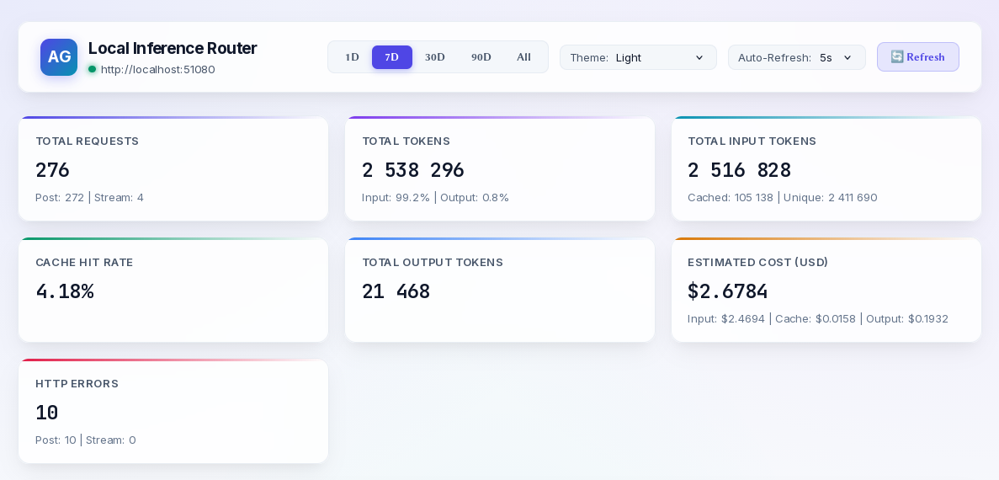
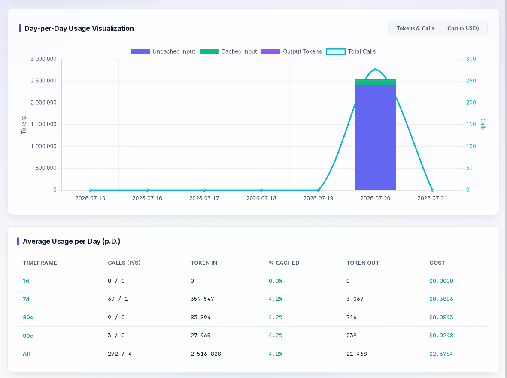
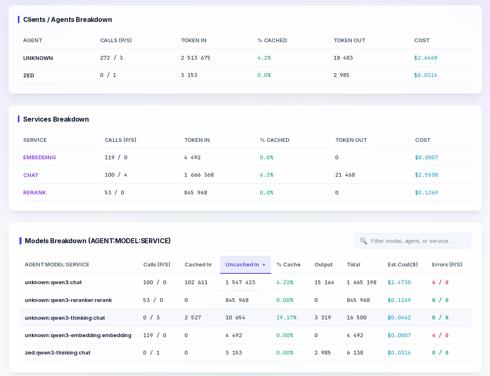

# Local Inference Router Service

`local-router.sh` manages the local services router systemd user service (`local-router.service`), running a FastAPI web application served by `uvicorn` on port `51080`. It aggregates all underlying local inference services into a single OpenAI-compatible entrypoint with additional features.

On installation, the Python code is copied from `scripts/local-router.py` to the systemd user directory (`~/.config/systemd/user/local-router.py`), and is served directly from there.

- **Source Code Repository Path**: [scripts/local-router.py](file:///home/wuxxin/agent-shared/code/agents-shared/scripts/local-router.py)
- **Control Wrapper**: [assistants/local-router.sh](file:///home/wuxxin/agent-shared/code/agents-shared/assistants/local-router.sh)

## System & Python Dependencies

The following packages must be installed in the Python environment:
- **fastapi**: Async web framework used to expose endpoints.
- **uvicorn**: High-performance ASGI server for running the FastAPI app.
- **httpx**: Async HTTP client for proxying and streaming requests to backends.
- **tiktoken**: BPE tokenizer used to estimate token counts.
- **prometheus_client**: Serves cumulative statistics on `/metrics` for Prometheus scraping.

## Usage

- Install the service and environment configuration:
  - `./local-router.sh install [--no-start] [--new-config]`
- Start/Stop/Restart the service:
  - `./local-router.sh start`
  - `./local-router.sh stop`
  - `./local-router.sh restart`
- Check runtime status:
  - `./local-router.sh status`
- Tail service stdout/stderr logs:
  - `./local-router.sh logs -f`
- Edit service environment configuration and auto-restart:
  - `./local-router.sh edit`
- Run API validation tests:
  - `./local-router.sh test`
- Inspect the aggregated usage:
  - `./local-router.sh usage [today|all|7d|30d|90d]`
- Run uvicorn as a transient systemd user service:
  - `./local-router.sh exec [--env KEY=VALUE]* [-- uvicorn-args...]`

## Configuration & Routing Details

The service is configured in:
- `~/.config/systemd/user/local-router.env`

Default configuration values:
```env
LROUT_PORT=51080
LROUT_HOST=127.0.0.1
LROUT_EXTRA_ARGS=""
LROUT_DEFAULT_MODEL="qwen3"
LROUT_LOG_LEVEL="info"
```

### Route Map (Port 51080)

| Route | Service | Default Model | Target Port | Description |
| :--- | :---: | :---: | :---: | :---: |
| `GET /health` or `/healthz` | Health Aggregator | - | - | Aggregated health check and connection test for all backends |
| `GET /v1/models` | Cached Model Inventory | - | - | Model list and OpenAI-compatible pricing objects |
| `GET /v1/usage` or `/usage` | Usage API | - | - | Cumulative token, call, cost, and error metrics (JSON or text) |
| `GET /v1/metrics` or `/metrics` | Prometheus Metrics | - | - | Prometheus metric scrapable endpoint |
| `GET /routing/ui` or `/ui` | Web Dashboard | - | - | Standalone single-page Web Dashboard SPA |
| `GET /v1/props` or `/props` | Local-Chat | - | 50080 | Engine model properties query (proxied to chat service) |
| `POST /v1/tokenize` or `/tokenize` | Resolved backend | `LROUT_DEFAULT_MODEL` | - | BPE tokenization (routes to model's service backend) |
| `POST /v1/detokenize` or `/detokenize` | Resolved backend | `LROUT_DEFAULT_MODEL` | - | BPE detokenization (routes to model's service backend) |
| `POST /v1/chat/completions` | Local-Chat | `qwen3` | 50080 | LLM completions (uses default template settings) |
| `POST /v1/chat/completions` | Local-Chat | `qwen3-thinking` | 50080 | LLM completions (forces thinking/CoT reasoning ON) |
| `POST /v1/completions` or `/completion` | Local-Chat | `qwen-coder-fim` | 50080 | Text & FIM code completions |
| `POST /v1/embeddings` or `/embedding` | Local-Chat or Embedding | `qwen3-embedding` | 50082 or 50080 | Vector text embeddings |
| `POST /v1/rerank` or `/rerank` | Local-Rerank | `qwen3-reranker` | 50086 | Text document ranking & scoring |
| `POST /v1/audio/transcriptions` | Local-Speech-To-Text | `whisper-1` | 50090 | Whisper speech transcription |
| `POST /v1/audio/speech` | Local-Text-To-Speech | `qwen3-tts` | 50095 | Speech synthesis |
| `POST /v1/images/generations` | Local-Image | `z-image-turbo` | 50100 | Image generation |
| `/{path:path}` | Catch-all | - | - | Graceful 404 handler for unmapped proxy paths |

### Health Check Endpoint (`GET /health` or `/healthz`)

The router exposes an aggregated status check endpoint. It tests TCP connections to all configured local backend service ports with a 0.5-second timeout and returns an aggregated status payload:
```json
{
  "status": "ok",
  "backends": {
    "chat": "online",
    "embedding": "online",
    "rerank": "online",
    "stt": "online",
    "tts": "online",
    "image": "online"
  }
}
```
If a backend service is stopped or unreachable, its status is marked as `"offline"`.

### Properties Endpoint (`GET /props` or `/v1/props`)

Queries engine properties (e.g. `llama-server` runtime parameters, context limit, build flags). The router proxies this request directly to the default `chat` service (port `50080`).

### Tokenization & Detokenization Endpoints (`POST /tokenize`, `/detokenize`)

Allows callers to tokenize prompt text into raw token IDs or convert token IDs back into text:
- The router parses the `"model"` property in the JSON body to resolve the target backend service.
- If no model is specified, it uses `LROUT_DEFAULT_MODEL` to resolve the service (defaulting to `chat` on port `50080`).
- The payload is forwarded to the corresponding backend server's `/tokenize` or `/detokenize` endpoint.

### Special Model Aliases & Parameter Rewriting

To accommodate client integrations that do not support custom request bodies or template arguments (such as the Zed Editor), the router exposes virtual model aliases:
- **`qwen3-thinking`**: Exposes the same backend `qwen3` model but forces chain-of-thought (CoT) reasoning **ON** by default.
  When a request is received, the router:
  1. Rewrites `"model": "qwen3-thinking"` back to `"model": "qwen3"` so `llama-server` accepts it.
  2. Dynamically injects `"chat_template_kwargs": {"enable_thinking": true}` into the request payload.
  3. Forwards the modified payload to the chat service.
  This allows specific clients to leverage thinking while other services (like hindsight) target `qwen3` for low-latency non-thinking calls.


### Startup Synchronization & Model Inventory

On startup, the router parses `~/.config/systemd/user/local-inference.env` to identify which sub-services are enabled. It then polls all enabled services:
- For backends supporting models (`chat`, `embedding` if standalone, `rerank`), it queries their `/v1/models` HTTP endpoint.
- For backends not exposing a models endpoint (`stt`, `tts`, `image`), it checks if their TCP port is open.

The router polls every 2 seconds for up to **1 minute**.
- If all enabled services become available, it constructs a global model inventory mapping model IDs and configured aliases to their respective services, then begins serving requests.
- If not all services are online within 1 minute, the router prints an error to standard error and aborts startup with exit code `1`.

### Model Pricing Object

The `/v1/models` endpoint returns models with a `"pricing"` object containing token cost estimation details. This conforms to standard OpenAI-compatible pricing payloads and enables clients like Hermes to calculate execution costs.

Example model object return:
```json
{
  "id": "qwen3",
  "object": "model",
  "owned_by": "local-inference",
  "pricing": {
    "prompt": "0.0000015",
    "completion": "0.0000090",
    "input_cache_read": "0.00000015",
    "input_cache_write": "0.0000015"
  }
}
```

The pricing values are modeled based on corresponding commercial standards:

| Service | Configured Model / Alias | Pricing Reference | Prompt (per token) | Completion (per token) | Cache Read (per token) | Cache Write (per token) |
| :--- | :--- | :--- | :--- | :--- | :--- | :--- |
| `chat` | `qwen3` | Gemini 3.5 Flash | `$0.00000150` | `$0.00000900` | `$0.00000015` | `$0.00000150` |
| `chat` | `qwen-coder-fim` | Gemini 3.5 Flash | `$0.00000150` | `$0.00000900` | `$0.00000015` | `$0.00000150` |
| `embedding` | `qwen3-embedding` | Gemini Embedding 001 | `$0.00000015` | `$0.00000000` | `$0.00000000` | `$0.00000000` |
| `rerank` | `qwen3-reranker` | Jina/Gemini Embedding | `$0.00000015` | `$0.00000000` | `$0.00000000` | `$0.00000000` |
| `image` | `z-image-turbo` | Gemini 3.1 Flash Image | `$0.00000050` | `$0.00006000` | `$0.00000000` | `$0.00000000` |
| `tts` | `qwen3-tts` | Gemini 3.1 Flash TTS | `$0.00000100` | `$0.00002000` | `$0.00000000` | `$0.00000000` |
| `stt` | `whisper-1` | OpenAI Whisper | `$0.00000000` | `$0.00003000` | `$0.00000000` | `$0.00000000` |

*Note: For Speech-to-Text (`whisper-1`), the completion cost corresponds to `$0.006` per minute of speech assuming an average speaking speed of 150 words (200 tokens) per minute.*

### Default Model Routing

When clients request tokenization (`/tokenize` or `/detokenize`) without specifying a `model` parameter in the request body, the router checks if `LROUT_DEFAULT_MODEL` is configured in `local-router.env` and maps to an active service in the inventory.
- If found, the request is routed to the corresponding service (e.g. `embedding` if `LROUT_DEFAULT_MODEL="qwen3-embedding"`).
- Otherwise, it falls back to routing to the `chat` service on port `50080`.

### Dynamic Embedding Routing

The router inspects `~/.config/systemd/user/local-inference.env`:
- If `LMBD_ENABLED=1` (standard setup): `/v1/embeddings` is routed to the dedicated `local-embedding` service on port `50082`.
- If `LMBD_ENABLED=0` (combined embeddings mode): `/v1/embeddings` is routed to `local-chat` on port `50080`.

### Error Propagation

If any backend service is down, offline, or returns an error, the router responds gracefully with a JSON object in the standard OpenAI error format:
```json
{
  "error": {
    "message": "Local service backend (http://127.0.0.1:50080) is currently offline or unreachable. [Errno 111] Connection refused",
    "type": "gateway_error",
    "code": 502
  }
}
```
This ensures integration clients (like agents or tools) receive clean HTTP errors (`502 Bad Gateway` / `503 Service Unavailable`) instead of failing with connection breaks.

### Client Resolution & Identification

The router automatically detects and normalizes the caller's agent identity strictly from incoming requests:
1. **Custom HTTP Headers (`X-Client-ID` / `X-Agent-ID` / `X-Client` / `X-Agent`)**: Explicit custom client identification headers. Header values are sanitized (stripping quotes, whitespace, and special characters) and converted to lowercase.
2. **Request Body Payload (`client_id` / `agent_id` / `extra_body.client_id`)**: For services (like Hindsight via `HINDSIGHT_API_LLM_EXTRA_BODY`) where provider SDKs embed custom parameters in the JSON request body rather than HTTP headers.
3. **Fallback**: Unmapped or missing identifiers are classified as `unknown` and logged to `sys.stderr` for operator diagnostics.

### Usage & Metrics API

The router transparently tracks token counts, call count (differentiating between `streaming_calls` and `calls_post`), HTTP error codes, and estimated USD costs by `agent:model:service`.

#### 1. JSON Usage API (`GET /usage` or `/v1/usage`)
Returns cumulative counts grouped by `agent:model:service`, agent totals, service totals, and grand total.
- **Query Parameters**:
  - `?range=today|all|7d|30d|90d` (defaults to `all`).
  - `?day=YYYY-MM-DD` (optional specific date filter).
  - `?format=json|text` (defaults to `json`. If set to `text`, returns a pre-formatted ASCII table and HTTP error breakdown).
- **Response Format**:
```json
{
  "models": {
    "hermes:qwen3:chat": {
      "calls": 12,
      "streaming_calls": 8,
      "calls_post": 4,
      "input": 1200,
      "cached_input": 500,
      "cached_write": 200,
      "output": 800,
      "total_tokens": 2700,
      "cache_pct": 29.41,
      "costs": {
        "cached_input_cost": 0.000075,
        "input_cost": 0.0018,
        "cached_write_cost": 0.0003,
        "output_cost": 0.0072,
        "total_cost": 0.009375
      },
      "req_stats": {
        "input": {"min": 100, "median": 200, "max": 500},
        "input_read": {"min": 0, "median": 100, "max": 300},
        "input_write": {"min": 0, "median": 50, "max": 150},
        "output": {"min": 50, "median": 150, "max": 400},
        "per_request": {"min": 200, "median": 500, "max": 1200}
      },
      "errors_streaming": {
        "400": 0, "401": 0, "403": 0, "404": 0, "408": 0,
        "429": 1, "500": 0, "502": 0, "503": 0, "504": 0, "OTHER": 0
      },
      "errors_post": {
        "400": 0, "401": 0, "403": 0, "404": 0, "408": 0,
        "429": 0, "500": 0, "502": 0, "503": 0, "504": 0, "OTHER": 0
      }
    }
  },
  "agents": { ... },
  "services": { ... },
  "totals": { ... }
}
```

#### 2. Prometheus Endpoint (`GET /metrics` or `/v1/metrics`)
Exposes cumulative metrics formatted for Prometheus scrapers:
- `local_router_calls_total{agent="...", service="...", model="..."}`: Total calls routed.
- `local_router_calls_active{agent="...", service="...", model="..."}`: Count of active in-flight requests currently waiting to return.
- `local_router_client_cancel_total{agent="...", service="...", model="..."}`: Cumulative count of requests canceled or abandoned by clients (status 499).
- `local_router_tokens_total{agent="...", service="...", model="...", type="..."}`: Total tokens processed (`type` can be `input`, `cached_input`, `cached_write`, `output`, `total`).
- `local_router_cost_total{agent="...", service="...", model="...", type="..."}`: Cumulative estimated USD cost (`type` matches the token types).
- `local_router_errors_total{agent="...", service="...", model="...", call_type="streaming|post", code="..."}`: Cumulative count of HTTP errors grouped by agent, service, model, status code, and call type.

### Diagnostics & Debug Flags (`LROUT_LOG_LEVEL`, `--verbose`, `--debug`)

`scripts/local-router.py` fuses verbosity configuration into a single overrideable hierarchy (checking CLI arguments `--verbose`/`--debug`, process environment variables `LROUT_LOG_LEVEL`/`LROUT_VERBOSE`/`LROUT_DEBUG`, and `~/.config/systemd/user/local-router.env`):
- **`LROUT_LOG_LEVEL="info"`** (default): Standard silent proxy operation.
- **`LROUT_LOG_LEVEL="verbose"` / `--verbose` / `LROUT_VERBOSE=1`**:
  - Prints connection probing details on startup (including fallback probing `/health` if `/v1/models` returns 404, e.g. for TEI embedding engines).
  - Logs each completed request to `stderr` with caller identity (`client`), path, target service, model ID, input/output token counts, status code (including custom `status=499` for client cancellations), and execution duration.
- **`LROUT_LOG_LEVEL="debug"` / `--debug` / `LROUT_DEBUG=1`**:
  - Enables `verbose` logging.
  - Outputs raw JSON request payloads and raw response/result contents to `stderr` for inspecting payload structures and debugging API incompatibilities.

### CLI Usage Reporting

You can inspect the aggregated usage directly from the command line:
```bash
./local-router.sh usage [today|all|7d|30d|90d]
```
This queries the running API (`/usage?format=text`) and displays an aligned ASCII text table containing all call counts, token allocations, cache percentages, cost calculations, and an HTTP Errors Breakdown section.

### Context Caching & Pricing Concepts

Context caching optimizes processing costs for repetitive large prompts (e.g., chat histories, long instructions, code bases). The pricing registry defines four core pricing fields:

- **`prompt`**: Billed for processing normal, uncached prompt segments (often called regular input).
- **`completion`**: Billed for generating assistant/output tokens.
- **`input_cache_write`**: Billed when a reusable prompt prefix is compiled and stored in the model's KV cache. In standard providers, this is typically billed at the standard `prompt` token rate.
- **`input_cache_read`**: A heavily discounted rate (typically 10-20% of standard `prompt` cost) charged when subsequent queries successfully reference and reuse the already cached KV prefix.

#### How It Is Counted:
1. When a query is routed, the router extracts the token allocation from the engine response (or estimates it via `tiktoken` as a fallback).
2. If the engine reports cache hits (`cached_tokens` / `cache_read_input_tokens`), the router records them under `cached_input`.
3. The remaining input tokens are recorded under `input` (uncached prompt tokens).
4. Estimated costs are computed dynamically by multiplying each token classification by its registry price.


### Web Dashboard UI (`GET /routing/ui` or `/ui`)

The router includes a standalone, responsive Web Dashboard SPA served directly at `http://localhost:51080/routing/ui` (or `/ui`).







- **Origin Interaction**: Queries the router's JSON usage API (`/usage?range=...`) dynamically relative to its origin (`window.location.origin`).
- **Theme Support**: Auto-detects system browser preference (`dark` / `light`) with an explicit header theme selector (`Auto`, `Dark`, `Light`).
- **Features**:
  - **KPI Cards Grid**: Real-time summary for Total Requests, Total Tokens, Total Input Tokens, Cache Hit Rate %, Total Output Tokens, Estimated USD Cost, and HTTP Errors (responsive 4 → 3 → 2 → 1 grid layout).
  - **Time-range Selector**: Switch between `1D`, `7D`, `30D`, `90D`, and `All` time windows.
  - **Day-per-Day Chart.js Visualization**: Interactive time-series stacked bar/line chart (Uncached Input, Cached Input, Output Tokens, Total Calls, Estimated Cost). Selected legend dataset visibilities survive refreshes.
  - **Average Usage per Day (p.D.) Table**: Displays daily averages across `1d`, `7d`, `30d`, `90d`, and `All`.
  - **Breakdown Tables**: Separate structured tables for Clients / Agents Breakdown and Services Breakdown (`AGENT/SERVICE`, `CALLS P/S`, `TOKEN IN`, `% CACHED`, `TOKEN OUT`, `COST`).
  - **Searchable Models Breakdown Table**: Detailed breakdown by `AGENT:MODEL:SERVICE` (`Calls P/S`, `Cached In`, `Uncached In`, `~ Size`, `% Cache`, `~ Size`, `Output`, `~ Size`, `Total`, `p.TimeT`, `Est.Cost($)`, `Errors P/S`) with sticky column sorting, live search filtering, and per-request median size columns.

