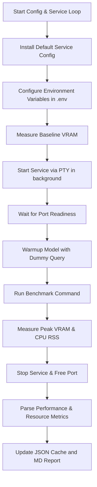

# run-local-benchmark

`run-local-benchmark.py` is a comprehensive Python automation script designed to run, measure, and record benchmarks for local inference services across different hardware backends.

It automates target environment setups, captures VRAM/RAM resource utilization, executes speed tests, and formats a comparative report.

## Supported Services

- **Chat (`chat` / `local-llm-ggml.sh`)**: Measures prompt prefill speed, generation/decode throughput, and Time-To-First-Token (TTFT).
- **Text Embedding (`embedding` / `local-embedding.sh`)**: Measures document embedding throughput (tokens/second) and average chunk latency.
- **Document Reranking (`rerank` / `local-rerank.sh`)**: Measures reranking throughput (documents/second) and token evaluation speed.
- **Speech-to-Text (`stt` / `local-speech-to-text.sh`)**: Measures transcription time and the Real-Time Factor (RTF).
- **Text-to-Speech (`tts` / `local-text-to-speech.sh`)**: Measures speech synthesis duration, RTF, and character speed (characters/second).

## Supported Hardware Configurations

- **HIP (`hip`)**: Uses ROCm (AMD Radeon GPU acceleration) via device `ROCm0`.
- **Vulkan (`vulkan`)**: Uses Vulkan compute backend via device `Vulkan0`.
- **CPU (`cpu`)**: Runs entirely on the host CPU (utilizing OpenBLAS/BLAS for llama-server).
- **Special (`special` / `special-hybrid` / `special-gpu-low-mem`)**: Evaluates custom modes like low-memory VRAM configurations or hybrid CPU-GPU execution (primarily tested for TTS).

---

## Benchmark Execution Workflow

The script executes the following sequence for each selected configuration and service combination:



### 1. Environment Configuration
The script dynamically overrides `.env` files located in `~/.config/systemd/user/` (e.g. `local-embedding.env`). It configures:
- Service ports (e.g., chat: `50080`, embedding: `50082`, rerank: `50086`, stt: `50090`, tts: `50095`).
- Target backend devices (e.g., `ROCm0`, `Vulkan0`, `BLAS`).
- Model layer allocations (`EMBED_N_GPU_LAYERS`, `LLM_N_GPU_LAYERS`, etc.).

### 2. VRAM Baseline Isolation
Before the service process is spawned, `get_gpu_memory_mb()` is called to query the baseline VRAM allocation. This prevents the model loading footprint itself from polluting the baseline, allowing accurate calculation of model-specific VRAM footprint via `post_run_vram - baseline_vram`.

### 3. Transient Service Startup
To avoid dependency on active user systemd daemons, the services are started transiently:
- Spawned as a background process using the control script's `exec` action (e.g., `local-embedding.sh exec`).
- Spawned inside a pseudo-terminal PTY allocation using `pty.openpty()` to capture stdout streams directly.
- The script polls the service port until it is open and active before proceeding.

### 4. Model Warmup
For services using `llama-server`, a warmup API call is sent first. This ensures any delayed compilation, initial model layer allocation, or context loading overhead is triggered prior to logging throughput metrics.

### 5. Benchmark Execution
The script executes the service control script with the `test` action and benchmark-specific arguments:
- e.g., `local-embedding.sh test --benchmark --repeat 1`
- The control scripts delegate performance measurement to `scripts/benchmark-helper.py` which runs realistic payloads (e.g., embedding paragraphs from `benchmark-context.md`).

### 6. Metric Extraction & Resource Capture
- **Performance:** Parses the stdout text generated by the test runner using regex pattern matches.
- **CPU Footprint:** Measures resident set size (RSS) memory of processes matching the service pattern.
- **GPU Footprint:** Reads VRAM usage again right before stopping the service and subtracts the baseline VRAM.
- **JSON Cache State:** Saves the structured results to `assistants/local-benchmark.json`. If a test is aborted or skipped, previous valid results are preserved.
- **Markdown Report:** Renders a clean table comparison and a detailed metrics list into `assistants/local-benchmark.md`.

---

## CLI Usage

```bash
# Basic run: tests all configurations and all services
python3 scripts/run-local-benchmark.py

# Test only HIP and Vulkan backends for Embedding and Reranker
python3 scripts/run-local-benchmark.py --configs hip,vulkan --only-services embedding,rerank

# Dry-run (mock mode) to verify report formatting and script parsing logic
python3 scripts/run-local-benchmark.py --mock
```

### Options

| Option | Default | Description |
| :--- | :--- | :--- |
| `--configs` | `hip,vulkan,cpu,special` | Comma-separated list of hardware configurations to test. |
| `--only-services` | `chat,embedding,rerank,stt,tts` | Comma-separated list of services to test. |
| `--mock` | `False` | Run in simulation mode (does not start servers or run actual tests). |
| `--output-file` | `assistants/local-benchmark.md` | Path to output comparative report. |
